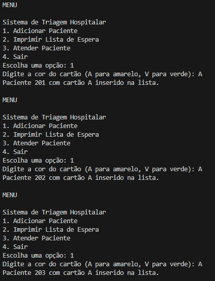
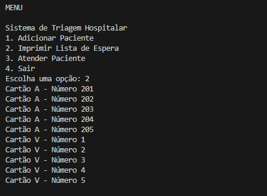
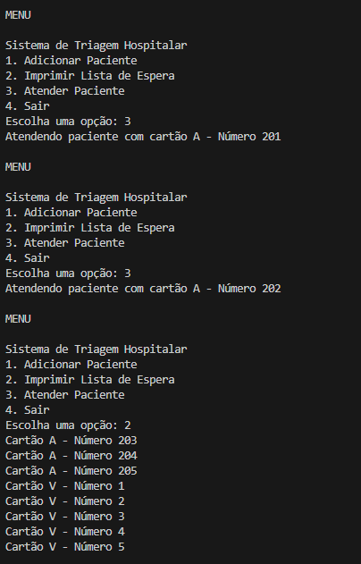

# Sistemas de Triagem Hospitalar em Python


## Visão Geral

Este repositório contém um projeto em Python desenvolvido para uma tarefa da faculdade com foco em estruturas de dados:

1. **Sistema de Triagem Hospitalar**  
   Implementação de uma fila de prioridade usando lista encadeada simples para gerenciar a triagem de pacientes com base na cor e número do cartão.
---

### Exigência de código 1 de 7
- Implementar lista encadeada simples.
- O Nodo representa um cartão numerado contendo: número, cor e um ponteiro para o próximo paciente.
- A lista é não circular ( o último elemento aponta para None).

### Cartão / Paciente / Nodo

```python
class Patient:
    def __init__(self, number, color):
        self.number = number
        self.color = color
        self.next = None  # Referência para o próximo paciente na lista

# Lista encadeada simples para pacientes
class PatientList:
    def __init__(self):
        self.head = None
        self.number_card_green = 1
        self.number_card_yellow = 201
  ```


- Aqui temos a definição do *Nodo* com três atributos obrigatórios e o inicio da *ListaEncadeada* com o ponteiro para a cabeça(head).

- **Nodo(nó):** Representa um elemento (Paciente) da lista, em estrutura de dados um *nodo* é uma célula de uma estrutura encadeada que guarda um valor e também uma referência para outro(próximo)nodo.


### Exigência de código 2 de 7
- Implementar função para adicionar pacientes sem prioridade à lista.
- O paciente deve ser inserido no **final da lista**.

### Função `insertWithoutPriority`

```python
def insertWithoutPriority(self, patient):
    if not self.head:
        self.head = patient
    else:
        current = self.head
        while current.next:
            current = current.next
        current.next = patient
```


### Exigência de código 3 de 7
- Implementar função para adicionar pacientes com prioridade à lista.
- O paciente com prioridade (cartão amarelo - "A") deve ser inserido **após todos os pacientes com prioridade já existentes**, mas sempre **antes dos pacientes sem prioridade** (cartão verde - "V").

### Função `insertWithPriority`

```python
def insertWithPriority(self, patient):
    if not self.head or self.head.color == 'V':
        patient.next = self.head
        self.head = patient
    else:
        current = self.head
        while current.next and current.next.color == 'A':
            current = current.next
        patient.next = current.next
        current.next = patient
```

### Exigência de código 4 de 7
- Implementar função para inserir pacientes/cartão/nodo.
- Solicita a cor do cartão, atribui o número automaticamente conforme a cor e chama a função de inserção apropriada (com ou sem prioridade).

```python
def insert_patient(self):
    color = input("Digite a cor do cartão (A para amarelo, V para verde): ").strip().upper()
    if color not in ['A', 'V']:
        print("Cor inválida. Use 'A' para amarelo ou 'V' para verde.")
        return
    if color == 'A':
        patient = Patient(self.number_card_yellow, color)
        self.number_card_yellow += 1
        self.insert_with_priority(patient)
    else:
        patient = Patient(self.number_card_green, color)
        self.number_card_green += 1
        self.insert_without_priority(patient)
    print(f"Paciente {patient.number} com cartão {color} inserido na lista.")


```

### Observação
- O número do cartão é atribuído automaticamente conforme a cor:

- Cartões amarelos ("A") começam do 201 em diante.

- Cartões verdes ("V") começam do 1 em diante.

- A função chama insert_with_priority para cartões amarelos (pacientes com prioridade) e insert_without_priority para cartões verdes (pacientes sem prioridade).


### Exigência de código 5 de 7
- Implementar função para imprimir a lista de espera de pacientes.
- A função deve percorrer a lista encadeada e imprimir o número do cartão e a cor de cada paciente.
- A função percorre a lista encadeada a partir do nodo cabeça (head).
- Caso a lista esteja vazia, imprime uma mensagem informando isso.

```python
def imprimir_lista_espera(self):
    current = self.head
    if not current:
        print("A lista de espera está vazia.")
        return
    while current:
        print(f"Paciente Número: {current.number}, Cor do Cartão: {current.color}")
        current = current.next

```

### Exigência de código 6 de 7
- Implementar função para atender pacientes.
- A função remove o primeiro paciente da lista (o próximo a ser atendido) e imprime o número e a cor do cartão do paciente atendido.
- Caso a lista esteja vazia, imprime uma mensagem avisando que não há pacientes na lista.

```python
def attend_patient(self):
    if not self.head:
        print("Nenhum paciente na lista de espera")
        return
    patient = self.head
    self.head = self.head.next
    print(f"Atendendo paciente com cartão {patient.color} - Número {patient.number}")

```


### Exigência de código 7 de 7
- Implementar a função principal para executar o sistema de triagem com um menu interativo.


- A função mantém o programa rodando até o usuário escolher sair.


```python
def main():
    patient_list = PatientList()
    while True:
        print("\nMENU")
        print("\nSistema de Triagem Hospitalar")
        print("1. Adicionar Paciente")
        print("2. Imprimir Lista de Espera")
        print("3. Atender Paciente")
        print("4. Sair")
        choice = input("Escolha uma opção: ").strip()

        if choice == '1':
            patient_list.insert_patient()
        elif choice == '2':
            patient_list.print_waiting_list()
        elif choice == '3':
            patient_list.attend_patient()
        elif choice == '4':
            print("Saindo do sistema.")
            break
        else:
            print("Opção inválida. Tente novamente.")

if __name__ == "__main__":
    main()


```


- O menu permite ao usuário:
     - Adicionar pacientes (chamando insert_patient)
         
     - Imprimir a lista de espera (print_waiting_list)
         
     - Atender o próximo paciente (attend_patient)
         
     - Sair do sistema


